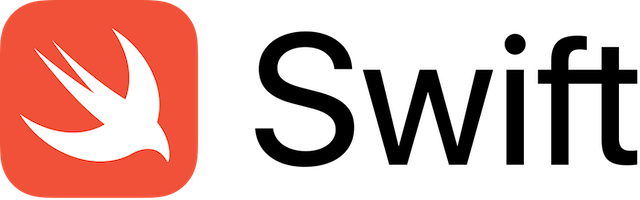

# swift-interview-questions

    

---------------------
Repositório com intuito de organizar, por tópicos, resumos feitos para estudos da linguagem Swift. Os resumos foram feitos baseados em um compilado de questões de entrevistas para vagas de pessoa desenvolvedora iOS.

As questões ficarão separadas por nível de dificuldade e cada tópico terá também um resumo curto sobre o assunto.

## Iniciante 

1. [UIKit VS SwiftUI](/1-introducao/uikit-vs-swiftui.md)
2. [Struct VS Class](/1-introducao/struct-vs-class.md)
3. [Protocols](/1-introducao/protocols.md)